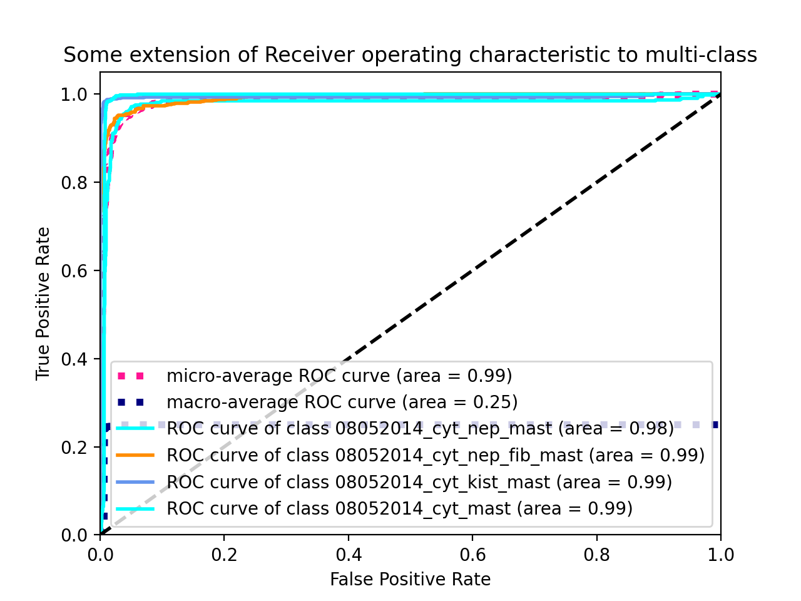

# Multi-class ROC

# Install

`pip install python-roc`

> This package is build using `poetry`, so you can use it for installation.

# Usage

## From predictions

```python
import numpy as np
from python_roc import roc_from_predictions

y = np.array([[1, 0], [0, 1]])
y_score = np.array([[0.9, 0.1], [0.2, 0.8]])

roc_from_predictions(y_score, y)
```

## From compiled Keras model

```python
import numpy as np
from python_roc import roc_from_keras_model

x = np.array([[1,2,3], [4,5,6]])
y = np.array([[1, 0], [0, 1]])

roc_from_keras_model(model, x, y)
```

# Examples


